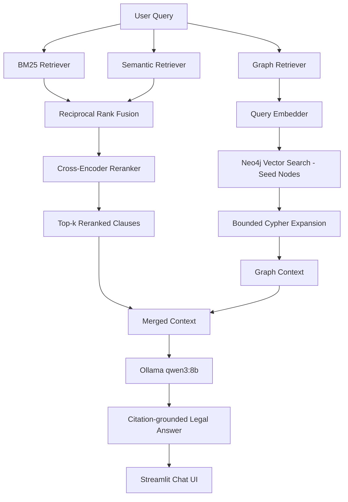

# ⚖️ LegalRAG: Hybrid Legal Retrieval-Augmented Generation System

## 🚀 Project Highlights

- Hybrid Retrieval combining BM25 and Dense Vector Search
- Persistent ChromaDB semantic indexing
- Reciprocal Rank Fusion (RRF)
- Cross-Encoder reranking for query-document relevance scoring
- Knowledge Graph retrieval over Neo4j with bounded multi-hop expansion
- Local LLM generation via Ollama
- Metadata-aware legal chunking
- Modular retrieval architecture
- Production-ready retrieval diagnostics
- Automatic index validation and rebuilding
- Interactive Streamlit chat frontend

| Category         | Technologies                              |
| ----------------- | ------------------------------------------ |
| Language          | Python                                     |
| Framework         | LangChain                                  |
| Embeddings        | MiniLM (`all-MiniLM-L6-v2`)                |
| Vector DB         | ChromaDB                                   |
| Lexical Search    | BM25                                       |
| Ranking (stage 1) | Reciprocal Rank Fusion                     |
| Ranking (stage 2) | Cross-Encoder (`ms-marco-MiniLM-L-6-v2`)   |
| Knowledge Graph   | Neo4j (Cypher)                             |
| LLM Serving       | Ollama (`qwen3:8b`)                        |
| Frontend          | Streamlit                                  |

<div align="center">


**A Production-Grade Hybrid Retrieval-Augmented Generation (RAG) System for Intelligent Legal Contract Analysis**

Combining **Lexical Search**, **Semantic Search**, **Hybrid Ensemble Retrieval**, **Cross-Encoder Reranking**, **Knowledge Graph Reasoning**, and a **local Large Language Model** to enable accurate, explainable, and citation-grounded legal document retrieval — accessible through an interactive chat interface.

</div>

---

# 📖 Overview

Legal contracts contain highly specialized terminology, nested clause dependencies, exact statutory references, and complex relationships between parties. Traditional search systems struggle to retrieve the correct information because they generally rely on only one retrieval paradigm.

Conventional keyword search retrieves exact terms but cannot understand semantic meaning, while dense vector search captures semantic similarity but often fails on exact identifiers such as clause numbers, statutory references, and contract-specific terminology. Furthermore, neither approach can naturally reason across relationships between entities such as organizations, contracts, obligations, or legal disputes.

This project addresses these limitations with a full retrieval-to-generation pipeline: every query passes through **hybrid lexical/semantic retrieval**, is refined by a **cross-encoder reranker**, is augmented with **knowledge-graph context from Neo4j**, and is finally answered by a **locally-served LLM (Ollama)** — all surfaced through a **Streamlit chat interface**.

---

# 🎯 Problem Statement

Modern legal search systems encounter three major retrieval challenges:

### 1. Lexical Failure

Semantic search models frequently struggle with exact identifiers.

Example:

```text
Section 409A
Clause 10.2
10-Q
Force-Majeure
```

These identifiers require exact lexical matching rather than semantic similarity.

---

### 2. Semantic Failure

Traditional keyword search cannot understand meaning.

For example, searching

```text
Extreme weather exemption
```

may fail to retrieve clauses titled

```text
Force Majeure

Act of God

Natural Disaster
```

despite their legal equivalence.

---

### 3. Relational Failure

Legal reasoning often requires traversing relationships between multiple entities.

Example:

> Has Company A signed a licensing agreement with Company B that contains an indemnification clause?

Answering such queries requires reasoning across interconnected entities rather than retrieving isolated document chunks. This is handled by the knowledge graph retrieval stage described below.

---

# 💡 Solution Architecture

This project implements a **multi-stage retrieval and generation pipeline** that combines sparse retrieval, dense retrieval, cross-encoder reranking, and structured graph reasoning before handing grounded evidence to a local LLM.

Each incoming query is processed as follows:

- **BM25 Retriever** performs exact lexical matching for statutory references, contract identifiers, and legal terminology.
- **Semantic Retriever** uses transformer embeddings and ChromaDB to capture contextual similarity beyond exact keywords.
- **Hybrid Retriever** applies **Reciprocal Rank Fusion (RRF)** to merge sparse and dense retrieval results into a unified ranked candidate set.
- **Cross-Encoder Reranker** rescores the fused candidates with full query-document attention, producing the final top-k clauses.
- **Graph Retriever** independently embeds the query, seeds a Neo4j vector search, and expands the local graph neighborhood (bounded BFS) to surface related entities and relationships.
- **Ollama (`qwen3:8b`)** synthesizes the reranked clauses and graph context into a citation-grounded legal answer, refusing to speculate when evidence is insufficient.
- **Streamlit** provides a ChatGPT-style interface for asking questions and viewing answers, while full retrieval diagnostics are logged to the terminal.

This layered architecture significantly improves recall, precision, explainability, and robustness compared to traditional single-retriever RAG systems.

---

# ✨ Current Features

- ✅ Metadata-aware legal document parsing
- ✅ Contract preprocessing and semantic chunking
- ✅ Production-ready BM25 lexical retrieval
- ✅ Transformer-based semantic retrieval using MiniLM embeddings
- ✅ Persistent ChromaDB vector indexing
- ✅ Hybrid Retrieval using Reciprocal Rank Fusion (RRF)
- ✅ Cross-Encoder reranking (`cross-encoder/ms-marco-MiniLM-L-6-v2`)
- ✅ Knowledge Graph retrieval over Neo4j with bounded multi-hop expansion
- ✅ Query embedding and Neo4j vector-index search for graph seeding
- ✅ Local LLM answer generation via Ollama (`qwen3:8b`, temperature 0)
- ✅ Interactive Streamlit chat frontend with conversation history
- ✅ Retrieval diagnostics and debugging utilities
- ✅ Automatic vector index validation and rebuilding
- ✅ Graceful degradation when Neo4j or Ollama is unavailable
- ✅ Modular retrieval pipeline with interchangeable components

---

# 🏗️ System Architecture

The retrieval pipeline follows a modular architecture where each component is responsible for a single stage of the retrieval process. Every module exposes a clean interface, making the system extensible and allowing new retrieval engines to be integrated without modifying the existing pipeline.



The current implementation includes:

- ✅ BM25 Sparse Retrieval
- ✅ Semantic Retrieval using ChromaDB
- ✅ Reciprocal Rank Fusion (RRF)
- ✅ Cross-Encoder Reranking
- ✅ Knowledge Graph Retrieval (Neo4j)
- ✅ Ollama LLM Generation
- ✅ Streamlit Frontend
- ⏳ Retrieval evaluation / benchmarking suite (in progress)

---

# ⚙️ End-to-End Pipeline

The system converts raw legal contracts into a searchable retrieval corpus, then serves queries through the full retrieval-to-generation pipeline.

**Offline (already built, not re-run by the frontend):**

```text
                           CUAD Dataset
                                │
                                ▼
                      Metadata Extraction
                                │
                                ▼
                    Contract Normalization
                                │
                                ▼
                      Semantic Chunking
                                │
              ┌─────────────────┴─────────────────┐
              ▼                                   ▼
      BM25 Inverted Index                 ChromaDB Vector Index
                                                    │
                                                    ▼
                                    Knowledge Graph (Neo4j) + Graph Embeddings
```

**Online (per query, served by the Streamlit app):**

```text
                              User Query
                                   │
                 ┌─────────────────┴─────────────────┐
                 ▼                                   ▼
         Hybrid Retrieval                     Graph Retrieval
   (BM25 + Semantic → RRF)             (Query Embed → Vector Seed
                 │                       → Bounded Cypher Expansion)
                 ▼                                   │
        Cross-Encoder Rerank                         │
                 │                                   │
                 └───────────────┬───────────────────┘
                                 ▼
                         Merged Context
                                 ▼
                        Ollama (qwen3:8b)
                                 ▼
                Citation-grounded Legal Response
                                 ▼
                       Streamlit Chat UI
```

The retrieval layer has been intentionally designed as a collection of interchangeable modules rather than a monolithic pipeline. This allows future retrieval engines—such as metadata filtering or adaptive query routing—to be integrated without changing the existing retrievers.

---

# 🧩 Retrieval Components

## 1. Document Parser

**File**

```text
src/parser.py
```

The parser ingests the CUAD (Contract Understanding Atticus Dataset) JSON corpus and converts every contract into a normalized document representation suitable for downstream retrieval.

Current capabilities include:

- Extraction of complete contract text
- Metadata normalization
- Contract title parsing
- Contract type identification
- Document ID generation
- Raw metadata preservation
- Stratified sampling across contract categories

Each parsed document is converted into a unified internal schema that is shared by every downstream retrieval module.

Example:

```text
Raw Contract

↓

Metadata Extraction

↓

Normalized Document

↓

Chunking Pipeline
```

---

## 2. Legal Chunking Pipeline

**File**

```text
src/chunker.py
```

Rather than performing naïve text splitting, the chunker applies legal-aware preprocessing before generating retrieval chunks.

Major preprocessing operations include:

- Removal of irrelevant whitespace
- Normalization of punctuation
- Preservation of legal modifiers
- Metadata prepending
- Recursive text splitting
- Configurable chunk overlap

Unlike traditional NLP preprocessing, important legal modifiers are intentionally preserved.

Examples include:

```text
shall
shall not
provided that
unless
except
subject to
```

Removing these terms would fundamentally alter the legal meaning of many contractual clauses.

Each generated chunk stores:

- Document ID
- Chunk ID
- Title
- Contract Type
- Section
- Metadata
- Chunk Text

This metadata later becomes available to every downstream retrieval, reranking, and graph module.

---

## 3. BM25 Lexical Retrieval

**File**

```text
src/retriever.py
```

The lexical retrieval engine provides exact keyword matching using the BM25 ranking algorithm.

A custom legal tokenizer was implemented to preserve important identifiers that would normally be destroyed by generic tokenization.

Examples include:

```text
Section 409A

10-Q

Clause 5.2

Force-Majeure

Exhibit-10.3
```

Unlike traditional stop-word removal, legal identifiers and punctuation remain intact, significantly improving retrieval quality for statute references, clause numbers, and contract-specific terminology.

The retriever returns structured retrieval objects containing:

- BM25 score
- Chunk ID
- Document ID
- Contract metadata
- Retrieved text

rather than simple strings, making it compatible with downstream reranking and hybrid retrieval.

---

## 4. Semantic Retrieval

**File**

```text
src/semantic_retriever.py
```

While BM25 excels at retrieving exact keywords, it cannot understand semantic meaning. To overcome this limitation, the project incorporates dense vector retrieval using transformer-based sentence embeddings.

Each legal chunk is converted into a dense embedding using the **sentence-transformers/all-MiniLM-L6-v2** model and stored inside a persistent **ChromaDB** vector database.

```text
Legal Chunk

↓

MiniLM Embedding

↓

Dense Vector

↓

Persistent ChromaDB Index
```

Unlike lexical retrieval, semantic retrieval captures contextual similarity.

For example, a query such as

```text
Extreme weather exemption
```

can successfully retrieve clauses titled

```text
Force Majeure

Act of God

Natural Disaster
```

despite containing no overlapping keywords.

### Current Features

- Persistent ChromaDB storage
- Automatic vector index creation
- Automatic loading of existing indexes
- Automatic index validation
- Automatic index rebuilding when corpus changes
- Metadata-aware vector storage
- Similarity-based retrieval
- Runtime diagnostics
- Configurable retrieval depth

Each retrieved result preserves complete metadata, including

- Document ID
- Chunk ID
- Contract Title
- Contract Type
- Section
- Similarity Score
- Embedding Distance
- Semantic Rank

Maintaining a unified retrieval schema ensures compatibility across all retrieval engines.

---

## 5. Hybrid Ensemble Retrieval

**File**

```text
src/hybrid_retriever.py
```

Neither lexical search nor semantic search is sufficient in isolation.

Lexical retrieval struggles with paraphrased language.

Semantic retrieval struggles with exact identifiers.

The solution implemented in this project is **Hybrid Retrieval**, where both retrieval engines operate independently before their ranked outputs are merged using **Reciprocal Rank Fusion (RRF)**.

```text
                 User Query

          ┌────────┴────────┐

          ▼                 ▼

      BM25 Search      Semantic Search

          └────────┬────────┘

                   ▼

       Reciprocal Rank Fusion

                   ▼

        Unified Ranked Candidates
```

Unlike weighted score averaging, Reciprocal Rank Fusion is robust to differences in scoring distributions across retrieval systems.

For a document ranked at position *r*, the RRF score is computed as

\[
\text{RRF}(r)=\frac{1}{k+r}
\]

where *k* is a ranking constant (default `60`) controlling the influence of lower-ranked documents.

The final hybrid score is obtained by summing contributions from every retrieval engine, so documents retrieved by multiple independent retrievers naturally rise toward the top of the ranking.

### Hybrid Retrieval Pipeline

```text
User Query

↓

BM25 Top-N

+

Semantic Top-N

↓

Reciprocal Rank Fusion

↓

Hybrid Candidate Set

↓

Top-k Results → Cross-Encoder Reranker
```

### Hybrid Candidate Schema

Every candidate returned by the Hybrid Retriever contains a unified schema:

```text
Document ID
Chunk ID
Contract Title
Contract Type
Chunk Text
BM25 Rank
Semantic Rank
BM25 Score
Semantic Similarity
Semantic Distance
Hybrid Score
Retrieval Sources
```

This schema provides a common interface for every downstream module including reranking, graph retrieval, and LLM generation.

### Retrieval Source Tracking

Each retrieved document tracks which retrieval engines contributed to its selection, e.g. `["bm25"]`, `["semantic"]`, or `["bm25", "semantic"]`. This allows the pipeline to identify documents retrieved only lexically, only semantically, or by both engines — useful for debugging, benchmarking, and future retrieval strategies.

---

## 6. Cross-Encoder Reranking

**File**

```text
src/cross_encoder.py
```

Reciprocal Rank Fusion produces a strong candidate set, but it never lets the query and document interact directly. The **Cross-Encoder Reranker** closes this gap by scoring every `(query, chunk_text)` pair jointly using **`cross-encoder/ms-marco-MiniLM-L-6-v2`**, which captures fine-grained relevance signals that independent bi-encoder and BM25 scores miss.

```text
Hybrid Candidates (RRF)

↓

Cross-Encoder(query, chunk_text) — batched inference

↓

cross_score + rerank_position per candidate

↓

Sorted by cross_score (ties broken by hybrid_score, similarity, chunk_id)

↓

Top-k Reranked Clauses
```

Each reranked result preserves the original hybrid metadata (BM25 rank, semantic rank, retrieval sources) alongside the new `cross_score` and `rerank_position`, so the full ranking history of a chunk remains inspectable end-to-end.

---

## 7. Knowledge Graph Retrieval

**Files**

```text
src/graph/graph_retriever.py
src/graph/graph_vector_store.py
src/graph/query_embedder.py
```

The Graph Retriever is a pure orchestration layer over **Neo4j** that answers the relational questions BM25, semantic, and hybrid retrieval cannot: reasoning across entities such as organizations, contracts, obligations, and clause relationships.

```text
Query

↓

QueryEmbedder.embed()

↓

GraphVectorStore.vector_search() — nearest graph nodes (seed set)

↓

Bounded BFS Cypher Expansion (max_hops, per-node neighbor cap)

↓

Deduplicated connections per seed node

↓

Formatted graph context: {node_id, label, name, score, properties, connections}
```

Design characteristics:

- All Cypher lives in parameterized query templates — never generated by an LLM.
- A single shared `visited` set prevents re-expansion and cycles across all seed nodes and hops.
- Embedding vectors are stripped from every returned node before being handed to the LLM context builder.
- Every Neo4j read goes through one exception-safe execution helper, so a single failed traversal step degrades gracefully instead of crashing the request.
- If Neo4j credentials are not configured or the database is unreachable, the application continues running on hybrid retrieval + reranking alone.

---

## 8. Generation Layer (Ollama)

Retrieved clauses (post-rerank) and graph context are merged into a single grounded prompt and passed to a locally-served LLM via **Ollama**, using the **`qwen3:8b`** model at **temperature 0** for deterministic, low-hallucination output.

The generation prompt instructs the model to:

- Use only the retrieved evidence — never outside knowledge
- Explicitly say so when evidence is insufficient, rather than guessing
- Reference clause titles/sections where relevant

If Ollama is not running, the application reports this clearly instead of failing silently or crashing.

---

## 9. Streamlit Frontend

**File**

```text
streamlit_app.py
```

A ChatGPT-style Streamlit interface sits on top of the existing retrieval pipeline as a pure presentation layer — it does not reimplement or duplicate any retrieval, reranking, or graph logic.

- Dark theme, centered chat layout
- `st.chat_input()` conversation loop with persisted history via `st.session_state`
- "Clear Chat" control
- All components (BM25, Semantic, Hybrid, Cross-Encoder, Graph Retriever, LLM) are initialized exactly once per server process via `st.cache_resource`
- Full retrieval diagnostics (question, hybrid results, graph results, merged context, prompt, answer, stage timings) are printed to the terminal; the chat UI itself shows only the question and final answer
- Graceful degradation: the app keeps running (with a visible warning) if Neo4j or Ollama is unavailable at startup

---

# 📊 Retrieval Diagnostics

To simplify debugging and retrieval analysis, the Hybrid Retriever, Cross-Encoder Reranker, and Graph Retriever all include built-in diagnostic logging.

When enabled, the pipeline reports:

- Total BM25 / Semantic candidates and their overlap
- Hybrid score, BM25 rank, semantic rank, and retrieval sources per candidate
- Cross-encoder score and rerank position per candidate
- Number of graph seed nodes and expanded connections
- Per-stage timings (hybrid retrieval, reranking, graph retrieval, LLM generation, total)

These diagnostics have proven useful for identifying stale vector indexes, metadata inconsistencies, retrieval overlap issues, and slow pipeline stages.

---

# 📈 Retrieval Evaluation

The project includes an initial retrieval evaluation framework for measuring search quality.

Current evaluation metrics include

- Hit@k
- Recall@k
- Mean Reciprocal Rank (MRR)

The evaluation framework is designed to evolve into a more comprehensive benchmarking suite using manually labeled relevance judgments.

Planned metrics include

- Precision@k
- nDCG@k
- Context Recall
- Context Precision

Future RAG evaluation will additionally incorporate

- Faithfulness
- Answer Relevancy
- Citation Accuracy
- Context Utilization

using established evaluation frameworks such as **RAGAS** and **DeepEval**.

---

# 🚀 Why This Architecture?

Instead of relying on a single retrieval or ranking method, this project layers complementary techniques so each compensates for the others' weaknesses.

| Stage             | Strength                                                   | Weakness                              |
| ------------------ | ----------------------------------------------------------- | -------------------------------------- |
| BM25               | Exact legal terminology, statute numbers, clause references | Cannot understand semantics            |
| Dense Retrieval    | Semantic similarity and paraphrase understanding             | Poor at exact identifiers              |
| Hybrid (RRF)       | Combines lexical precision and semantic understanding        | Slightly higher computational cost     |
| Cross-Encoder      | Fine-grained query-document relevance via joint attention     | More expensive than bi-encoder scoring |
| Knowledge Graph    | Multi-hop relational reasoning across entities                | Requires a populated, maintained graph |
| Local LLM (Ollama) | Private, citation-grounded synthesis with no external API    | Bounded by local model capability      |

This layered architecture provides significantly better retrieval and answer quality than any individual component while remaining modular and extensible for future enhancements.

---

# ▶️ Running the App

```bash
streamlit run streamlit_app.py
```

Configuration is read from environment variables (a `.env` file is picked up automatically if present):

| Variable                 | Purpose                                              | Default                  |
| ------------------------- | ------------------------------------------------------ | -------------------------- |
| `PROCESSED_CHUNKS_PATH`   | Path to the pre-built processed corpus                | `processed_chunks.json`  |
| `OLLAMA_MODEL`            | Ollama model used for generation                       | `qwen3:8b`                |
| `NEO4J_URI`               | Neo4j Bolt URI                                          | —                          |
| `NEO4J_USERNAME`          | Neo4j username                                          | —                          |
| `NEO4J_PASSWORD`          | Neo4j password                                          | —                          |

If Neo4j or Ollama are not configured, the app still starts and serves answers from hybrid retrieval and cross-encoder reranking alone, with a warning shown in the UI.