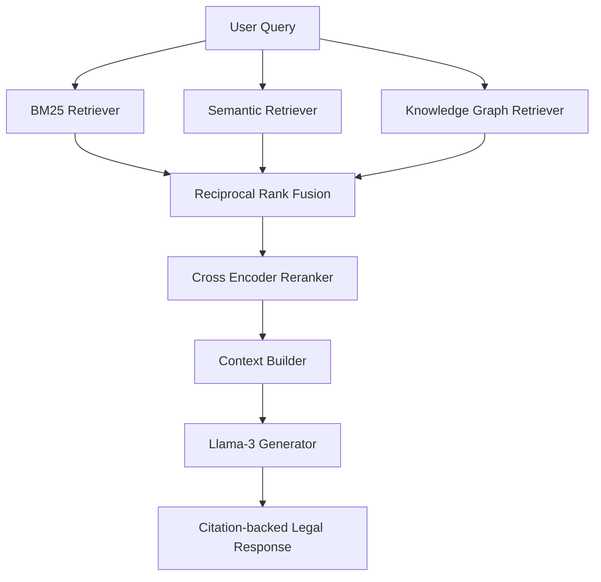

# ⚖️ LegalRAG: Hybrid Legal Retrieval-Augmented Generation System

## 🚀 Project Highlights

- Hybrid Retrieval combining BM25 and Dense Vector Search
- Persistent ChromaDB semantic indexing
- Reciprocal Rank Fusion (RRF)
- Metadata-aware legal chunking
- Modular retrieval architecture
- Production-ready retrieval diagnostics
- Automatic index validation and rebuilding
- Extensible architecture for Cross-Encoder reranking and Knowledge Graph retrieval

| Category       | Technologies           |
| -------------- | ---------------------- |
| Language       | Python                 |
| Framework      | LangChain              |
| Embeddings     | MiniLM                 |
| Vector DB      | ChromaDB               |
| Lexical Search | BM25                   |
| Ranking        | Reciprocal Rank Fusion |
| Database       | PostgreSQL             |
| ORM            | SQLAlchemy             |
| Deep Learning  | PyTorch                |
| LLM            | LLaMA-3 (Planned)      |


<div align="center">


**A Production-Grade Hybrid Retrieval-Augmented Generation (RAG) System for Intelligent Legal Contract Analysis**

Combining **Lexical Search**, **Semantic Search**, **Hybrid Ensemble Retrieval**, **Knowledge Graph Reasoning**, and **Large Language Models** to enable accurate, explainable, and citation-grounded legal document retrieval.

</div>

---

# 📖 Overview

Legal contracts contain highly specialized terminology, nested clause dependencies, exact statutory references, and complex relationships between parties. Traditional search systems struggle to retrieve the correct information because they generally rely on only one retrieval paradigm.

Conventional keyword search retrieves exact terms but cannot understand semantic meaning, while dense vector search captures semantic similarity but often fails on exact identifiers such as clause numbers, statutory references, and contract-specific terminology. Furthermore, neither approach can naturally reason across relationships between entities such as organizations, contracts, obligations, or legal disputes.

This project addresses these limitations by building a **Hybrid Retrieval-Augmented Generation (RAG) System** that combines multiple retrieval paradigms into a unified production-oriented pipeline.

Instead of relying on a single retriever, every user query is simultaneously processed by multiple retrieval engines, allowing the system to leverage the strengths of each retrieval strategy before generating a final context for downstream reasoning.

---

# 🎯 Problem Statement

Modern legal search systems encounter three major retrieval challenges:

### 1. Lexical Failure

Semantic search models frequently struggle with exact identifiers.

Example:

```text
Section 409A
Clause 10.2
10-Q
Force-Majeure
```

These identifiers require exact lexical matching rather than semantic similarity.

---

### 2. Semantic Failure

Traditional keyword search cannot understand meaning.

For example, searching

```text
Extreme weather exemption
```

may fail to retrieve clauses titled

```text
Force Majeure

Act of God

Natural Disaster
```

despite their legal equivalence.

---

### 3. Relational Failure

Legal reasoning often requires traversing relationships between multiple entities.

Example:

> Has Company A signed a licensing agreement with Company B that contains an indemnification clause?

Answering such queries requires reasoning across interconnected entities rather than retrieving isolated document chunks.

---

# 💡 Proposed Solution

This project implements a **Hybrid Ensemble Retrieval Pipeline** that combines sparse retrieval, dense retrieval, and structured graph reasoning into a single retrieval architecture.

Each incoming query is routed through multiple retrieval systems in parallel.

- **BM25 Retriever** performs exact lexical matching for statutory references, contract identifiers, and legal terminology.
- **Semantic Retriever** uses transformer embeddings and ChromaDB to capture contextual similarity beyond exact keywords.
- **Hybrid Retriever** applies **Reciprocal Rank Fusion (RRF)** to merge sparse and dense retrieval results into a unified ranked candidate set.
- **Knowledge Graph Retrieval** (under development) will enable entity-centric and multi-hop legal reasoning.
- **LLaMA-3** (planned) will synthesize retrieved evidence into citation-backed legal responses.

This layered retrieval architecture significantly improves recall, precision, explainability, and robustness compared to traditional single-retriever RAG systems.

---

# ✨ Current Features

- ✅ Metadata-aware legal document parsing
- ✅ Contract preprocessing and semantic chunking
- ✅ Production-ready BM25 lexical retrieval
- ✅ Transformer-based semantic retrieval using MiniLM embeddings
- ✅ Persistent ChromaDB vector indexing
- ✅ Hybrid Retrieval using Reciprocal Rank Fusion (RRF)
- ✅ Retrieval diagnostics and debugging utilities
- ✅ Automatic vector index validation and rebuilding
- ✅ Modular retrieval pipeline with interchangeable components
- ✅ Groundwork for Cross-Encoder reranking and Knowledge Graph retrieval

---

# 🏗️ System Architecture

The retrieval pipeline follows a modular architecture where each component is responsible for a single stage of the retrieval process. Every module exposes a clean interface, making the system extensible and allowing new retrieval engines to be integrated without modifying the existing pipeline.



The current implementation includes:

- ✅ BM25 Sparse Retrieval
- ✅ Semantic Retrieval using ChromaDB
- ✅ Reciprocal Rank Fusion (RRF)
- ⏳ Cross-Encoder Reranking
- ⏳ Knowledge Graph Retrieval
- ⏳ LangChain Orchestration
- ⏳ Fine-tuned LLaMA-3 Generation

---

# ⚙️ End-to-End Retrieval Pipeline

The system converts raw legal contracts into a searchable retrieval corpus through several independent processing stages.

```text
                           CUAD Dataset
                                │
                                ▼
                      Metadata Extraction
                                │
                                ▼
                    Contract Normalization
                                │
                                ▼
                      Semantic Chunking
                                │
              ┌─────────────────┴─────────────────┐
              ▼                                   ▼
      BM25 Inverted Index                 ChromaDB Vector Index
              │                                   │
              ▼                                   ▼
      Sparse Retrieval                  Dense Semantic Retrieval
              └──────────────┬────────────────────┘
                             ▼
                Reciprocal Rank Fusion (RRF)
                             ▼
               Hybrid Candidate Document Set
                             ▼
              Cross Encoder Reranker (Planned)
                             ▼
                  Top-k Context Selection
                             ▼
              Knowledge Graph Augmentation
                             ▼
               Fine-tuned LLaMA-3 Generator
                             ▼
             Citation-backed Legal Response
```

The retrieval layer has been intentionally designed as a collection of interchangeable modules rather than a monolithic pipeline. This allows future retrieval engines—such as graph retrieval, metadata filtering, or adaptive query routing—to be integrated without changing the existing retrievers.

---

# 🧩 Retrieval Components

## 1. Document Parser

**File**

```text
src/parser.py
```

The parser ingests the CUAD (Contract Understanding Atticus Dataset) JSON corpus and converts every contract into a normalized document representation suitable for downstream retrieval.

Current capabilities include:

- Extraction of complete contract text
- Metadata normalization
- Contract title parsing
- Contract type identification
- Document ID generation
- Raw metadata preservation
- Stratified sampling across contract categories

Each parsed document is converted into a unified internal schema that is shared by every downstream retrieval module.

Example:

```text
Raw Contract

↓

Metadata Extraction

↓

Normalized Document

↓

Chunking Pipeline
```

---

## 2. Legal Chunking Pipeline

**File**

```text
src/chunker.py
```

Rather than performing naïve text splitting, the chunker applies legal-aware preprocessing before generating retrieval chunks.

Major preprocessing operations include:

- Removal of irrelevant whitespace
- Normalization of punctuation
- Preservation of legal modifiers
- Metadata prepending
- Recursive text splitting
- Configurable chunk overlap

Unlike traditional NLP preprocessing, important legal modifiers are intentionally preserved.

Examples include:

```text
shall
shall not
provided that
unless
except
subject to
```

Removing these terms would fundamentally alter the legal meaning of many contractual clauses.

Each generated chunk stores:

- Document ID
- Chunk ID
- Title
- Contract Type
- Section
- Metadata
- Chunk Text

This metadata later becomes available to both lexical and semantic retrieval engines.

---

## 3. BM25 Lexical Retrieval

**File**

```text
src/retriever.py
```

The lexical retrieval engine provides exact keyword matching using the BM25 ranking algorithm.

A custom legal tokenizer was implemented to preserve important identifiers that would normally be destroyed by generic tokenization.

Examples include:

```text
Section 409A

10-Q

Clause 5.2

Force-Majeure

Exhibit-10.3
```

Unlike traditional stop-word removal, legal identifiers and punctuation remain intact, significantly improving retrieval quality for statute references, clause numbers, and contract-specific terminology.

The retriever returns structured retrieval objects containing:

- BM25 score
- Chunk ID
- Document ID
- Contract metadata
- Retrieved text

rather than simple strings, making it compatible with downstream reranking and hybrid retrieval.

---

## 4. Semantic Retrieval

**File**

```text
src/semantic_retriever.py
```

While BM25 excels at retrieving exact keywords, it cannot understand semantic meaning. To overcome this limitation, the project incorporates dense vector retrieval using transformer-based sentence embeddings.

Each legal chunk is converted into a dense embedding using the **sentence-transformers/all-MiniLM-L6-v2** model and stored inside a persistent **ChromaDB** vector database.

```text
Legal Chunk

↓

MiniLM Embedding

↓

Dense Vector

↓

Persistent ChromaDB Index
```

Unlike lexical retrieval, semantic retrieval captures contextual similarity.

For example, a query such as

```text
Extreme weather exemption
```

can successfully retrieve clauses titled

```text
Force Majeure

Act of God

Natural Disaster
```

despite containing no overlapping keywords.

### Current Features

- Persistent ChromaDB storage
- Automatic vector index creation
- Automatic loading of existing indexes
- Automatic index validation
- Automatic index rebuilding when corpus changes
- Metadata-aware vector storage
- Similarity-based retrieval
- Runtime diagnostics
- Configurable retrieval depth

Each retrieved result preserves complete metadata, including

- Document ID
- Chunk ID
- Contract Title
- Contract Type
- Section
- Similarity Score
- Embedding Distance
- Semantic Rank

Maintaining a unified retrieval schema ensures compatibility across all retrieval engines.

---

## 5. Hybrid Ensemble Retrieval

**File**

```text
src/hybrid_retriever.py
```

Neither lexical search nor semantic search is sufficient in isolation.

Lexical retrieval struggles with paraphrased language.

Semantic retrieval struggles with exact identifiers.

The solution implemented in this project is **Hybrid Retrieval**, where both retrieval engines operate independently before their ranked outputs are merged using **Reciprocal Rank Fusion (RRF)**.

```text
                 User Query

          ┌────────┴────────┐

          ▼                 ▼

      BM25 Search      Semantic Search

          └────────┬────────┘

                   ▼

       Reciprocal Rank Fusion

                   ▼

        Unified Ranked Candidates
```

Unlike weighted score averaging, Reciprocal Rank Fusion is robust to differences in scoring distributions across retrieval systems.

For a document ranked at position *r*, the RRF score is computed as

\[
\text{RRF}(r)=\frac{1}{k+r}
\]

where *k* is a ranking constant controlling the influence of lower-ranked documents.

The final hybrid score is obtained by summing contributions from every retrieval engine.

This allows documents retrieved by multiple independent retrievers to naturally rise toward the top of the ranking.

### Hybrid Retrieval Pipeline

```text
User Query

↓

BM25 Top-20

+

Semantic Top-20

↓

Reciprocal Rank Fusion

↓

Hybrid Candidate Set

↓

Top-k Results
```

---

## Hybrid Candidate Schema

Every candidate returned by the Hybrid Retriever contains a unified schema.

```text
Document ID

Chunk ID

Contract Title

Contract Type

Chunk Text

BM25 Rank

Semantic Rank

BM25 Score

Semantic Similarity

Semantic Distance

Hybrid Score

Retrieval Sources
```

This schema provides a common interface for every downstream module including reranking, graph retrieval, and LLM generation.

---

## Retrieval Source Tracking

Each retrieved document tracks which retrieval engines contributed to its selection.

Examples include

```text
["bm25"]

["semantic"]

["bm25", "semantic"]
```

This allows the pipeline to identify

- documents retrieved only lexically
- documents retrieved only semantically
- overlapping candidates retrieved by multiple engines

This information is useful for debugging, benchmarking, and future retrieval strategies.

---

# 📊 Retrieval Diagnostics

To simplify debugging and retrieval analysis, the Hybrid Retriever includes built-in diagnostic utilities.

When enabled, the pipeline reports

- Total BM25 candidates
- Total Semantic candidates
- Candidate overlap
- BM25-only candidates
- Semantic-only candidates
- Total fused candidates

Additionally, every final candidate can display

- Hybrid Score
- BM25 Rank
- Semantic Rank
- Semantic Similarity
- Embedding Distance
- Retrieval Sources
- Contract Title
- Chunk Identifier

These diagnostics proved particularly useful during development to identify stale vector indexes, metadata inconsistencies, and retrieval overlap issues.

---

# 📈 Retrieval Evaluation

The project includes an initial retrieval evaluation framework for measuring search quality.

Current evaluation metrics include

- Hit@k
- Recall@k
- Mean Reciprocal Rank (MRR)

The evaluation framework is designed to evolve into a more comprehensive benchmarking suite using manually labeled relevance judgments.

Planned metrics include

- Precision@k
- nDCG@k
- Context Recall
- Context Precision

Future RAG evaluation will additionally incorporate

- Faithfulness
- Answer Relevancy
- Citation Accuracy
- Context Utilization

using established evaluation frameworks such as **RAGAS** and **DeepEval**.

---

# 🚀 Why Hybrid Retrieval?

Instead of relying exclusively on dense retrieval, this project combines complementary retrieval paradigms.

| Retrieval Method | Strength | Weakness |
|------------------|----------|----------|
| BM25 | Exact legal terminology, statute numbers, clause references | Cannot understand semantics |
| Dense Retrieval | Semantic similarity and paraphrase understanding | Poor at exact identifiers |
| Hybrid Retrieval | Combines lexical precision and semantic understanding | Slightly higher computational cost |

This hybrid architecture provides significantly better retrieval quality than either individual retriever while remaining modular and extensible for future enhancements.